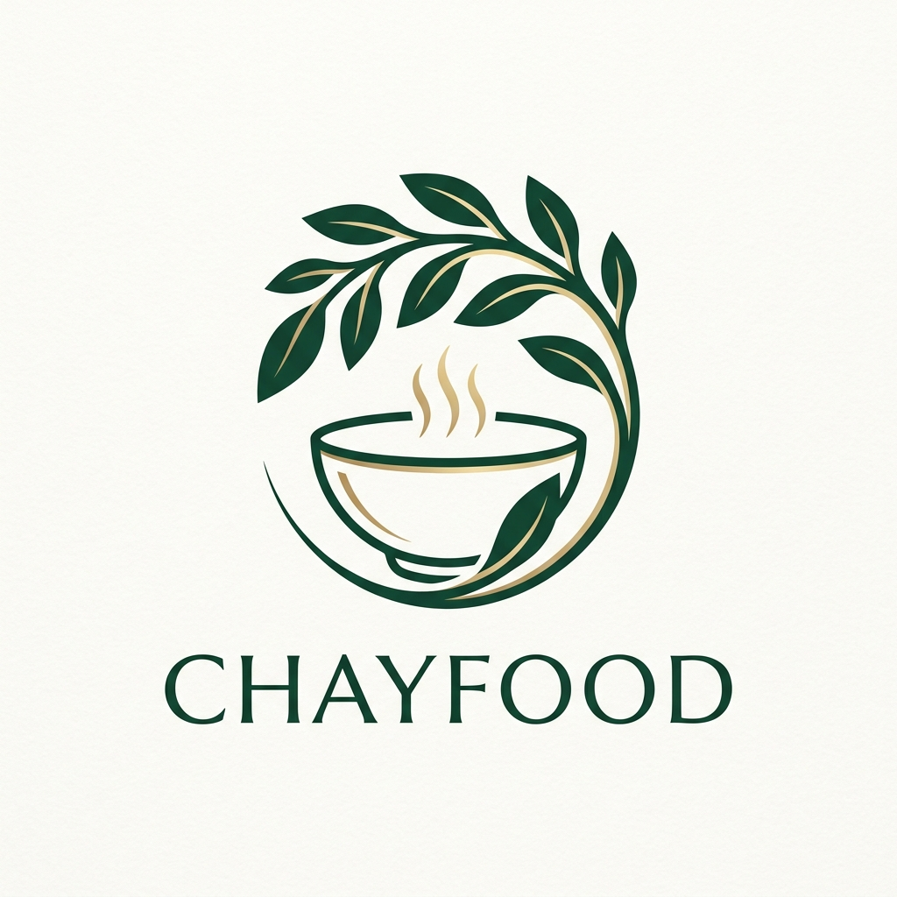
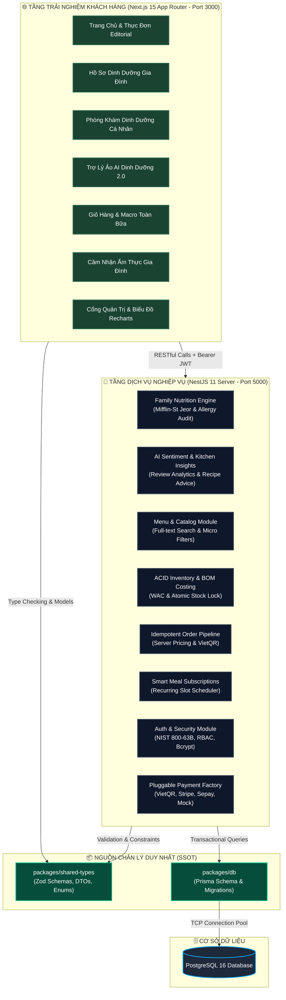

<div align="center">



# 🌿 ChayFood Monorepo
### Nền Tảng Ẩm Thực Thuần Thực Vật & Dinh Dưỡng Gia Đình Chuẩn Khoa Học

<p align="center">
  
  
  
  
  
</p>

<p align="center">
  <strong>Giải pháp mâm cơm gia đình đa thế hệ</strong> • <strong>Định lượng dinh dưỡng lâm sàng cá nhân hóa</strong> • <strong>AI phân tích cảm xúc & gợi ý cho bếp</strong> • <strong>Định mức giá vốn nguyên liệu (BOM)</strong>
</p>

</div>

---

## 📸 Bộ Ảnh Giao Diện Thực Tế (Visual Showcase & User Flows)

### 1. 🌐 Trải Nghiệm Thực Đơn & Dinh Dưỡng Khách Hàng

| Thực Đơn Đa Chế Độ (Dual-View Matrix) | Chi Tiết Món Ăn & Dược Tính Thảo Mộc |
|:---:|:---:|
|  |  |

| Giỏ Hàng & Macro Toàn Bữa (4-4-9 Standard) | Hồ Sơ Sức Khỏe & Chỉ Số Sinh Học Cá Nhân |
|:---:|:---:|
|  |  |

| Tiến Trình Theo Dõi Đơn Hàng (Live Stepper) | Thuê Bao Gói Ăn Chay Định Kỳ (Subscriptions) |
|:---:|:---:|
|  |  |

---

### 2. 👑 Cổng Quản Trị Vận Hành & Giá Vốn (Admin Operations Portal)

| Bảng Điều Khiển Quản Trị & Biểu Đồ Recharts BI | Quản Lý Định Mức BOM & Kho Bãi Nguyên Liệu |
|:---:|:---:|
|  |  |

| Quản Lý Thực Đơn & Tạo Món 2 Cột | Danh Mục Khách Hàng & Slide-over Drawer |
|:---:|:---:|
|  |  |

---

## 🌟 1. Tổng Quan Nền Tảng & Các Tính Năng Đột Phá (Platform Highlights)

**ChayFood** là nền tảng ẩm thực thuần thực vật thế hệ mới, tiên phong kết hợp giữa nghệ thuật ẩm thực truyền thống Việt Nam và khoa học dinh dưỡng lâm sàng. Hệ thống giải quyết trọn vẹn bài toán dinh dưỡng cho **mâm cơm gia đình đa thế hệ** — nơi mỗi thành viên đều có thể trạng và kiêng kị dị ứng riêng biệt.

```
       👨‍👩‍👧‍👦 MÂM CƠM GIA ĐÌNH ĐA THẾ HỆ CHAYFOOD
  ┌────────────────────────────────────────────────────────┐
  │ 👴 Ông Bà:   Thanh đạm, kiểm soát đường huyết (Low-GI) │
  │ 👨 Cha Mẹ:   Đạm thực vật cao, giảm mỡ & săn chắc cơ   │
  │ 🧒 Con Nhỏ:  Giàu vi chất Canxi & Kẽm, dễ hấp thu      │
  └────────────────────────────────────────────────────────┘
```

---

### 🏆 Danh Mục Năng Lực Trọng Tâm Của Hệ Thống:

#### 1. 👨‍👩‍👧‍👦 Động Cơ Dinh Dưỡng Mâm Cơm Gia Đình & Kiểm Toán Dị Ứng Chéo (Family Nutrition Engine)
- **Cá nhân hóa theo từng thành viên**: Tự động tính toán nhu cầu năng lượng (BMR/TDEE) theo công thức Mifflin-St Jeor cho từng người trong gia đình.
- **Kiểm toán dị ứng chéo (Cross-Allergy Audit)**: Thuật toán quét toàn bộ thực đơn theo thời gian thực, loại bỏ các món chứa nguyên liệu kích ứng của bất kỳ thành viên nào trong mâm cơm.
- **Gán khẩu phần riêng biệt**: Cho phép gán từng món ăn cho từng người cụ thể (Bản thân, Cha mẹ, Con cái) ngay trong giỏ hàng.

#### 2. 🧠 AI Phân Tích Cảm Xúc Thực Khách & Gợi Ý Cho Bếp Trưởng (AI Sentiment & Kitchen Insights Engine)
- **Phân tích cảm xúc bình luận đa chiều**: AI tự động đọc hiểu và phân tích sắc thái cảm xúc trong từng bài đánh giá của thực khách (độ đậm đà, vị ngọt tự nhiên của rau củ, độ giòn của nấm, cảm giác nhẹ bụng sau ăn).
- **Gợi ý cải tiến công thức cho bếp**: Tự động tổng hợp phản hồi thành các khuyến nghị thiết thực gửi trực tiếp về Cổng Bếp Trưởng (ví dụ: tinh chỉnh lượng gia vị thảo mộc cho nhóm khách cao tuổi hoặc tăng tỷ lệ hạt họ đậu cho nhóm tập gym).
- **Vòng lặp phản hồi ẩm thực khép kín**: Kết nối liền mạch giữa cảm nhận thực tế của gia đình thực khách và quy trình nâng chuẩn món ăn của đội ngũ đầu bếp.

#### 3. 🤖 Trợ Lý Ảo AI Dinh Dưỡng Thực Vật (AI Dietary Assistant 2.0)
- **Tư vấn thông minh thời gian thực**: Trợ lý AI nổi (Floating Chat Agent) sẵn sàng giải đáp về Calo, Đạm thực vật, chỉ số đường huyết (GI) và thực đơn tăng cơ/giảm mỡ.
- **Cơ chế Fallback lâm sàng xác định**: Tự động chuyển sang các luật dinh dưỡng chuẩn hóa khi mất kết nối mạng hoặc cạn token API.
- **Smart Bottom-Clamping Scroll**: Tự động cuộn thông minh chống hiện tượng giật màn hình khi đọc lại tin nhắn cũ.

#### 4. 🍽️ Thực Đơn Đa Chế Độ & Tùy Biến Khẩu Phần (Dual-View Menu & Portion Matrix)
- **Dual-View Switcher**: Chuyển đổi linh hoạt giữa chế độ Nhiếp ảnh ẩm thực sang trọng và Ma trận Mật độ vi chất dinh dưỡng.
- **Tùy biến khẩu phần linh hoạt**: Khẩu phần tiêu chuẩn, Tăng cường đạm thực vật (+10g đạm từ nấm và đậu nướng), hoặc Khẩu phần nhẹ Low-Carb.
- **Bộ lọc đa chiều**: Lọc theo khoảng calo, ngưỡng đạm tối thiểu, món cay, không gluten, không đậu phộng.

#### 5. ⭐ Cộng Đồng Đánh Giá & Cảm Nhận Ẩm Thực Gia Đình (Customer Reviews & Sensory Feedback)
- **Đánh giá trải nghiệm thực tế**: Người dùng gửi cảm nhận về độ thanh đạm, hương vị thảo mộc và chỉ số no lâu của món ăn.
- **Gắn liền thành viên thưởng thức**: Cho phép người gửi chọn danh tính thành viên gia đình đã trải nghiệm món để cung cấp góc nhìn chân thực cho cộng đồng.
- **Xác thực bảo mật**: Rào chắn kiểm tra phiên đăng nhập chặt chẽ giúp ngăn chặn đánh giá ảo và nội dung rác.

#### 6. 🌿 Minh Bạch Công Thức & Dược Tính Món Ăn (Transparent Culinary Recipe & Health Benefits)
- **Phân tích dược tính thảo mộc**: Thuyết minh chi tiết công dụng thanh nhiệt, dưỡng nhan, hỗ trợ tim mạch và phục hồi thể lực của từng món.
- **Minh bạch nguyên liệu**: Liệt kê nguồn gốc nguyên liệu hữu cơ, quy trình sơ chế và cách thức chế biến giữ trọn vi chất.

#### 7. 🧮 Phòng Khám Dinh Dưỡng Cá Nhân Hóa (Nutrition Planner & Biomarkers Wizard)
- **Khảo sát thể trạng 4 bước**: Khảo sát tuổi, giới tính sinh học, chiều cao, cân nặng, tần suất vận động và mục tiêu sức khỏe.
- **Đánh giá chỉ số sinh học**: Tính BMI theo thang chuẩn WHO Châu Á, ước tính BMR và tổng tiêu hao năng lượng TDEE.
- **Lập kế hoạch bữa ăn theo ngày**: Tạo thực đơn gợi ý phân bổ năng lượng sáng, trưa, tối chuẩn tỷ lệ $4\text{-}4\text{-}9$ (Đạm - Đường - Béo).

#### 8. ⚡ Pipeline Đặt Hàng & Thanh Toán Bất Biến (Idempotent Orders & VietQR)
- **Server-Authoritative Pricing**: Giá món ăn, phí giao hàng và voucher được tính toán độc lập tại server, chống can thiệp giá từ client.
- **Khóa bi quan (Pessimistic Locking)**: Chống Race Condition khi nhiều khách hàng cùng đặt món có số lượng giới hạn.
- **VietQR Động**: Tự động sinh mã QR chuẩn NAPAS247 kèm mã đơn hàng định danh, kích hoạt webhook xác nhận thanh toán tức thì.

#### 9. 📦 Quản Trị Kho ACID & Định Mức Giá Vốn (BOM & WAC Inventory Engine)
- **Định mức nguyên liệu (Bill of Materials - BOM)**: Quản lý công thức món ăn chi tiết tới từng gram nguyên liệu thô kèm hệ số quy đổi đơn vị chuẩn hóa.
- **Giá vốn bình quân gia quyền (Weighted Average Cost - WAC)**: Cập nhật giá vốn nguyên liệu chính xác sau mỗi đợt nhập kho.
- **Trừ kho nguyên tử (ACID Stock Deduction)**: Trừ kho trực tiếp trong Transaction cơ sở dữ liệu ngay khi tạo đơn, ngăn chặn triệt để tình trạng âm kho.

#### 10. 📅 Thuê Bao Gói Ăn Chay Định Kỳ & Gợi Ý Đổi Vị (Smart Meal Subscriptions)
- **Lên lịch giao cơm tự động**: Đăng ký gói ăn theo tuần hoặc tháng với các khung giờ giao linh hoạt.
- **Thuật toán gợi ý chống trùng lặp**: Tự động luân phiên đổi vị món ăn mỗi ngày dựa trên hồ sơ kiêng kị của khách hàng.
- **Cơ chế Starvation Fallback**: Tự động mở rộng tiêu chí chọn món khi các điều kiện lọc calo/protein quá khắt khe.

#### 11. 👑 Cổng Quản Trị Vận Hành & Bộ Biểu Đồ Phân Tích (Admin Operations & Recharts BI)
- **Dashboard trực quan với 6 loại biểu đồ**: Phân tích doanh thu, xu hướng đơn hàng, top món bán chạy, bản đồ phân bổ vùng miền và mật độ giờ cao điểm.
- **Quản lý thực đơn & công thức BOM**: Thêm, sửa, đóng/mở bán món ăn và cập nhật công thức định lượng trực tiếp.
- **Quản trị khuyến mãi Flash Sale**: Thiết lập voucher giảm giá theo phần trăm hoặc số tiền cố định với giới hạn lượt dùng chặt chẽ.

#### 12. 🔒 Hệ Thống Bảo Mật & Xác Thực Luxury (NIST 800-63B & Safe Redirect Defense)
- **Modal xác thực đa năng**: Hỗ trợ Đăng nhập, Đăng ký, Quên mật khẩu và Đặt lại mật khẩu với giao diện Glassmorphism cao cấp.
- **Safe Redirect Sanitizer (CWE-601)**: Bộ lọc làm sạch URL chuyển hướng chống tấn công Open Redirect và lừa đảo chiếm quyền.
- **Đăng nhập Google 1-Click**: Tích hợp OAuth liền mạch và tự động đồng bộ phiên đăng nhập vào Navbar mà không cần tải lại trang.

#### 13. 💳 Kiến Trúc Thanh Toán Đa Kênh Linh Hoạt (Pluggable Payment Gateway Factory)
- **Strategy & Factory Pattern**: Cho phép hoán đổi cổng thanh toán linh hoạt giữa môi trường phát triển (Mock/Dev) và môi trường thực tế (Production).
- **Đa dạng kênh giao dịch**: Hỗ trợ Chuyển khoản ngân hàng VietQR, Thẻ thanh toán quốc tế Stripe và cổng thanh toán tự động Sepay.

---

## 📐 2. Sơ Đồ Kiến Trúc Hệ Thống (System Architecture)

Hệ thống được thiết kế theo mô hình **Domain-Driven Modular Monorepo** với ranh giới trách nhiệm rõ ràng:



---

## 📦 3. Cấu Trúc Thư Mục Monorepo (Workspace Directory Structure)

```text
chayfood/
├── apps/
│   ├── web/                     # Frontend Next.js 15 App Router (@chayfood/web)
│   │   ├── app/
│   │   │   ├── account/         # Hồ sơ cá nhân, hồ sơ gia đình & lịch sử đơn hàng
│   │   │   │   ├── family/      # Quản lý thành viên gia đình & ma trận dị ứng
│   │   │   │   └── orders/      # Lịch sử đơn hàng & mua lại nhanh (Reorder)
│   │   │   ├── admin/           # Cổng quản trị thực đơn, kho bãi, BOM & biểu đồ
│   │   │   ├── cart/            # Giỏ hàng thông minh & tổng hợp macro toàn bữa
│   │   │   ├── checkout/        # Quy trình thanh toán an toàn & địa chỉ giao hàng
│   │   │   ├── menu/            # Khám phá thực đơn 2 chế độ, đánh giá & chi tiết món
│   │   │   ├── nutrition-planner/ # Phòng khám dinh dưỡng & hồ sơ sức khỏe
│   │   │   ├── order/           # Theo dõi trạng thái đơn hàng & mã VietQR
│   │   │   ├── components/      # UI Components, Auth Modals, AI Chat Agent
│   │   │   ├── globals.css      # Design Tokens & CSS Variables
│   │   │   └── layout.tsx       # RootLayout chuẩn SEO & Server Component
│   │   └── package.json
│   │
│   └── api/                     # Backend NestJS 11 Enterprise Server (@chayfood/api)
│       ├── src/
│       │   ├── auth/            # JWT Strategy, RolesGuard, NIST 800-63B Auth
│       │   ├── family/          # Dinh dưỡng gia đình lâm sàng & kiểm toán dị ứng
│       │   ├── menu/            # Quản lý món ăn, phân trang, lọc calo & protein
│       │   ├── inventory/       # Động cơ kho ACID, giá vốn WAC, khóa chống âm kho
│       │   ├── recipes/         # Định mức nguyên liệu BOM, tính food cost
│       │   ├── orders/          # Pipeline đặt hàng, khóa bi quan, VietQR
│       │   ├── subscriptions/   # Gói ăn định kỳ & gợi ý thực đơn thông minh
│       │   ├── payment/         # Xử lý cổng thanh toán (Strategy / Factory Pattern)
│       │   └── prisma/          # Prisma Global Module & Lifecycle Hooks
│       └── package.json
│
├── packages/
│   ├── db/                      # Prisma Schema, PostgreSQL Migrations & Seed Data
│   ├── shared-types/            # Nguồn chân lý duy nhất (SSOT Zod Schemas & Types)
│   └── tsconfig/                # Cấu hình TypeScript chuẩn toàn hệ thống
│
├── public/                      # Static Assets, Brand Logo & Showcase Images
│   └── logo.png                 # Logo biểu trưng ChayFood chính thức
├── docker-compose.yml           # Hạ tầng PostgreSQL 16 + pgAdmin Docker
├── pnpm-workspace.yaml          # Cấu hình Turborepo Workspaces
└── turbo.json                   # Pipeline biên dịch và Remote Caching
```

---

## 🧮 4. Các Động Cơ Kỹ Thuật Trọng Điểm (Core Engineering Engines)

### 1. Động Cơ Dinh Dưỡng Mâm Cơm Gia Đình (Family Nutrition Engine)
- **Công thức Mifflin-St Jeor**: Tính toán BMR và TDEE chuẩn xác theo từng thành viên:
  $$\text{BMR (Nam)} = 10W + 6.25H - 5A + 5 \qquad \text{BMR (Nữ)} = 10W + 6.25H - 5A - 161$$
- **Phân bổ tỷ lệ Calo chuẩn $4\text{-}4\text{-}9$**:
  $$\text{Tổng Năng Lượng (kcal)} = (\text{Protein} \times 4) + (\text{Carbs} \times 4) + (\text{Fat} \times 9)$$
- **Kiểm toán dị ứng chéo mâm cơm (Family Cross-Allergy Audit)**: Thuật toán quét toàn bộ thực đơn theo thời gian thực, loại bỏ các món chứa nguyên liệu kích ứng của bất kỳ thành viên nào trong mâm cơm.

### 2. Động Cơ Định Mức BOM & Giá Vốn WAC (BOM & Inventory Engine)
- **Bill of Materials (BOM)**: Mỗi món ăn được cấu thành từ danh mục nguyên liệu thô với hệ số quy đổi đơn vị chuẩn hóa ($g \to kg$, $ml \to l$).
- **Giá vốn bình quân gia quyền (Weighted Average Cost - WAC)**:
  $$\text{WAC Mới} = \frac{(\text{Tồn Cũ} \times \text{Giá Vốn Cũ}) + (\text{Nhập Mới} \times \text{Giá Nhập Mới})}{\text{Tổng Tồn Mới}}$$
- **Tự động trừ kho nguyên tử (ACID Stock Deduction)**: Trừ kho trực tiếp trong Database Transaction ngay khi đơn hàng được tạo, chặn triệt để tình trạng âm kho hoặc Over-selling.

### 3. Pipeline Đặt Hàng & Thanh Toán Bất Biến (Idempotent Orders)
- **Server-Authoritative Pricing**: Giá món ăn, phí giao hàng và khuyến mãi voucher được tính toán độc lập tại server, miễn nhiễm với tấn công can thiệp dữ liệu từ client.
- **Khóa bi quan (Pessimistic Locking)**: Chống Race Condition khi nhiều khách hàng cùng đặt món ăn có số lượng giới hạn tại cùng một thời điểm.
- **VietQR Động**: Tự động sinh mã QR ngân hàng kèm mã đơn hàng định danh, kích hoạt webhook xác nhận thanh toán tức thì.

---

## ⚡ 5. Hướng Dẫn Cài Đặt & Chạy Cục Bộ (Local Setup)

### Yêu Cầu Môi Trường
- **Node.js**: `>= 18.0.0`
- **pnpm**: `>= 9.0.0`
- **Docker & Docker Desktop**: Chạy cơ sở dữ liệu PostgreSQL

### Các Bước Khởi Chạy:

```bash
# 1. Cài đặt toàn bộ dependencies trong monorepo
pnpm install

# 2. Khởi chạy PostgreSQL trong Docker
pnpm db:up

# 3. Đồng bộ schema Prisma vào database và nạp dữ liệu mẫu
pnpm db:push
pnpm db:seed

# 4. Khởi chạy toàn bộ hệ thống (Frontend + Backend)
pnpm dev
```

### 🌐 Các Cổng Dịch Vụ:
- 🌐 **Frontend Web Client**: [http://localhost:3000](http://localhost:3000)
- 🧮 **Phòng Khám Dinh Dưỡng Cá Nhân**: [http://localhost:3000/nutrition-planner](http://localhost:3000/nutrition-planner)
- 🚀 **Backend NestJS REST API**: [http://localhost:5000/api](http://localhost:5000/api)
- 📖 **Swagger API Interactive Documentation**: [http://localhost:5000/api/docs](http://localhost:5000/api/docs)
- 📊 **Prisma Studio (Giao diện xem CSDL)**: `pnpm db:studio` ➔ [http://localhost:5555](http://localhost:5555)

---

## 🧪 6. Quy Trình Kiểm Thử Tự Động & CI/CD Pipeline

Dự án áp dụng tiêu chuẩn kiểm thử tự động nghiêm ngặt bảo vệ chất lượng mã nguồn:

```text
  [ Push / Pull Request ]
             │
             ▼
  ┌─────────────────────────────────────────────────────────────┐
  │  Stage 1: Strict Type-Check & Linting (Turborepo)           │
  │  • 100% PASS trên toàn bộ 5 packages (0 Type Error)        │
  │  • Tuân thủ nghiêm ngặt RULE-CODE-001 (Zero any / unknown) │
  └──────────────────────────────┬──────────────────────────────┘
                                 │ PASS
                                 ▼
  ┌─────────────────────────────────────────────────────────────┐
  │  Stage 2: Automated Unit & Integration Tests               │
  │  • 12/12 Test Suites PASS, 79/79 Unit Tests PASS           │
  │  • Kiểm thử toàn diện Family, Auth, WAC, BOM, Orders, Subs │
  └──────────────────────────────┬──────────────────────────────┘
                                 │ PASS
                                 ▼
  ┌─────────────────────────────────────────────────────────────┐
  │  Stage 3: Database Migration & Seeding Validation          │
  │  • PostgreSQL 16 Container Sanity Verification             │
  │  • Schema Invariants & Relationship Integrity              │
  └──────────────────────────────┬──────────────────────────────┘
                                 │ PASS
                                 ▼
  ┌─────────────────────────────────────────────────────────────┐
  │  Stage 4: Production Build Validation                      │
  │  • Next.js App Router SSR/SSG Bundle Compilation           │
  │  • NestJS Server Production Dist Compilation               │
  └─────────────────────────────────────────────────────────────┘
```

### Lệnh Chạy Kiểm Thử:
```bash
# 1. Chạy toàn bộ 79 unit tests backend
pnpm test

# 2. Chạy type-check toàn bộ 5 packages trong monorepo
pnpm type-check

# 3. Chạy kiểm tra build production
pnpm build
```

---

## 👨‍💻 Tác Giả & Tuyên Bố Dự Án
- **Dự Án**: ChayFood Monorepo (Precision Plant-Based Nutrition & Family Culinary Platform)
- **Mục Đích**: Dự án kỹ thuật tiêu chuẩn thể hiện tư duy System Design, Product Thinking và Clean Code Architecture
