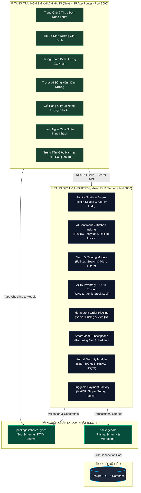

<div align="center">


# 🌿 ChayFood Monorepo
### Nền Tảng Ẩm Thực Thuần Thực Vật & Dinh Dưỡng Gia Đình Chuẩn Khoa Học

<p align="center">
  
  
  
  
  
</p>

<p align="center">
  <strong>Giải pháp mâm cơm gia đình đa thế hệ</strong> • <strong>Định lượng dinh dưỡng lâm sàng cá nhân hóa</strong> • <strong>Trí tuệ nhân tạo lắng nghe thực khách</strong> • <strong>Quản trị định mức giá vốn nguyên liệu</strong>
</p>

</div>

---

## 🌟 1. Tổng Quan Nền Tảng (Platform Overview)

**ChayFood** là nền tảng ẩm thực thuần thực vật thế hệ mới, kết hợp hài hòa giữa nét tinh tế của ẩm thực truyền thống Việt Nam và khoa học dinh dưỡng lâm sàng hiện đại. Hệ thống giải quyết trọn vẹn bài toán chăm sóc sức khỏe cho **mâm cơm gia đình đa thế hệ** — nơi mỗi thành viên đều có thể trạng và nhu cầu dinh dưỡng riêng biệt.

```
       👨‍👩‍👧‍👦 MÂM CƠM GIA ĐÌNH ĐA THẾ HỆ CHAYFOOD
  ┌────────────────────────────────────────────────────────┐
  │ 👴 Ông Bà:   Thanh đạm, kiểm soát đường huyết (Low-GI) │
  │ 👨 Cha Mẹ:   Đạm thực vật cao, giảm mỡ & săn chắc cơ   │
  │ 🧒 Con Nhỏ:  Giàu vi chất Canxi & Kẽm, dễ hấp thu      │
  └────────────────────────────────────────────────────────┘
```

---

### 🏆 Các Trụ Cột Năng Lực Trọng Tâm:

#### 1. 👨‍👩‍👧‍👦 Dinh Dưỡng Mâm Cơm Gia Đình & Kiểm Soát Dị Ứng Đa Thế Hệ
- **Cân đối thể trạng từng thành viên**: Tự động xác định nhu cầu năng lượng (BMR/TDEE) theo công thức Mifflin-St Jeor cho từng người trong nhà
- **Kiểm soát dị ứng 2 chiều**: Tự động nhận diện và loại trừ các món có chứa thành phần kiêng kị của bất kỳ thành viên nào trong bữa ăn
- **Phân bổ khẩu phần linh hoạt**: Cho phép chỉ định từng món ăn cho từng người thân ngay khi chọn món

#### 2. 🧠 AI Lắng Nghe Cảm Nhận Thực Khách & Đề Xuất Cải Tiến Bếp Trưởng
- **Thấu hiểu phản hồi đa chiều**: Trí tuệ nhân tạo tự động đọc hiểu và phân tích cảm xúc từ bài đánh giá (độ đậm đà, vị ngọt thanh tự nhiên, cảm giác nhẹ bụng sau ăn)
- **Khuyến nghị thiết thực cho bếp trưởng**: Tự động tổng hợp insight gửi về bộ phận bếp (ví dụ: tinh chỉnh lượng gia vị thảo mộc cho người cao tuổi hoặc bổ sung thêm đạm thực vật cho người tập luyện)
- **Vòng lặp nâng chuẩn ẩm thực khép kín**: Kết nối trực tiếp giữa trải nghiệm thực tế tại bàn ăn và quy trình sáng tạo món của đội ngũ đầu bếp

#### 3. 🤖 Trợ Lý AI Đồng Hành Dinh Dưỡng & Tư Vấn Khẩu Phần
- **Tư vấn thực đơn thông minh**: Trợ lý AI sẵn sàng giải đáp về Calo, Đạm thực vật, chỉ số đường huyết và gợi ý món ăn theo mục tiêu thể hình
- **Cơ chế dự phòng lâm sàng**: Tự động chuyển sang các quy tắc dinh dưỡng y khoa chuẩn hóa khi mất kết nối mạng
- **Trải nghiệm cuộn êm ái**: Tự động điều chỉnh vị trí màn hình thông minh giúp người dùng dễ dàng xem lại các lời khuyên trước đó

#### 4. 🍽️ Thực Đơn Đa Tầng: Trải Nghiệm Ẩm Thực & Phân Tích Vi Chất
- **Chuyển đổi giao diện linh hoạt**: Lựa chọn giữa góc nhìn nhiếp ảnh ẩm thực nghệ thuật và bảng ma trận định lượng vi chất
- **Tùy biến định lượng món ăn**: Dễ dàng lựa chọn Khẩu phần tiêu chuẩn, Tăng cường đạm thực vật (+10g đạm từ nấm và đậu hũ nướng) hoặc Khẩu phần nhẹ Low-Carb
- **Bộ lọc chuyên sâu**: Tìm kiếm nhanh theo khoảng năng lượng, lượng đạm mong muốn, món thuần chay không cay, không gluten, không đậu phộng

#### 5. ⭐ Lắng Nghe Cảm Nhận Thực Khách & Gắn Kết Gia Đình
- **Chia sẻ trải nghiệm chân thực**: Thực khách gửi cảm nhận về độ thanh tao, hương vị thảo mộc và cảm giác thư thái sau bữa ăn
- **Đánh giá theo từng thành viên**: Gắn liền cảm nhận với người thưởng thức trong gia đình (Bản thân, Cha mẹ, Con nhỏ) để tạo nguồn tham khảo hữu ích cho cộng đồng
- **Bảo vệ tính minh bạch**: Rào chắn xác thực tài khoản giúp ngăn chặn các đánh giá ảo và giữ trọn sự tin cậy

#### 6. 🌿 Minh Bạch Dược Tính Thảo Mộc & Nguồn Gốc Nguyên Liệu
- **Thuyết minh công dụng thảo mộc**: Phân tích giá trị thanh nhiệt, dưỡng nhan, hỗ trợ tim mạch và phục hồi thể lực của từng món ăn
- **Rõ ràng nguồn gốc nông sản**: Minh bạch xuất xứ nguyên liệu hữu cơ, quy trình sơ chế sạch và kỹ thuật chế biến bảo toàn vi chất

#### 7. 🧮 Khảo Sát Thể Trạng & Hoạch Định Dinh Dưỡng Cá Nhân Hóa
- **Khảo sát thể trạng 4 bước**: Thu thập thông tin độ tuổi, giới tính sinh học, chiều cao, cân nặng, mức độ vận động và mục tiêu sức khỏe
- **Phân tích chỉ số sinh học**: Đánh giá chỉ số thể trọng BMI chuẩn WHO Châu Á, ước tính chuyển hóa cơ bản BMR và tổng tiêu hao năng lượng TDEE
- **Gợi ý thực đơn theo ngày**: Thiết lập kế hoạch ăn uống phân bổ năng lượng sáng, trưa, tối theo tỷ lệ vàng $4\text{-}4\text{-}9$ (Đạm - Đường - Béo)

#### 8. ⚡ Quy Trình Đặt Món Chuẩn Xác & Thanh Toán VietQR Liền Mạch
- **Tính toán chi phí an toàn**: Đơn giá, ưu đãi thành viên và phí vận chuyển được xác thực độc lập tại máy chủ trung tâm
- **Kiểm soát đặt món đồng thời**: Cơ chế khóa giao dịch thông minh giúp chống tình trạng đặt vượt quá số lượng món ăn sẵn có
- **Mã VietQR động**: Tự động sinh mã chuyển khoản chuẩn NAPAS247 kèm mã đơn hàng định danh, kích hoạt xử lý đơn hàng tức thì

#### 9. 📦 Quản Trị Định Mức Nguyên Liệu (BOM) & Giá Vốn Tồn Kho (WAC)
- **Định mức công thức món ăn (BOM)**: Quản lý chi tiết từng gram nguyên liệu thô cấu thành món ăn kèm hệ số quy đổi đơn vị chuẩn mực
- **Giá vốn bình quân gia quyền (WAC)**: Tự động cập nhật giá vốn nguyên liệu sau mỗi đợt nhập hàng từ nông trại
- **Trừ kho chuẩn xác theo giao dịch**: Tự động khấu trừ kho nguyên liệu ngay khi tiếp nhận đơn hàng, bảo đảm số liệu tồn kho luôn khớp với thực tế

#### 10. 📅 Gói Cơm Chay Định Kỳ & Thuật Toán Đổi Vị Hàng Ngày
- **Đặt lịch giao cơm tự động**: Đăng ký gói ăn dinh dưỡng theo tuần hoặc tháng với các khung giờ giao thuận tiện
- **Luân chuyển món ăn thông minh**: Tự động gợi ý thực đơn đa dạng mỗi ngày, tránh lặp món và phù hợp với khẩu vị riêng của khách hàng
- **Cơ chế mở rộng tiêu chí linh hoạt**: Tự động nới lỏng tiêu chí lựa chọn khi các điều kiện lọc dinh dưỡng quá nghiêm ngặt

#### 11. 👑 Trung Tâm Điều Hành Vận Hành & Phân Tích Dữ Liệu Chuyên Sâu
- **Giao diện quản trị trực quan**: 6 biểu đồ phân tích xu hướng kinh doanh, doanh thu theo thời gian, món ăn được yêu thích và mật độ giờ cao điểm
- **Quản lý thực đơn & định mức**: Cập nhật trạng thái mở bán, biên tập mô tả món và điều chỉnh công thức nguyên liệu nhanh chóng
- **Thiết lập chương trình ưu đãi**: Quản lý các voucher tri ân khách hàng và khung giờ ưu đãi với hạn mức rõ ràng

#### 12. 🔒 Hệ Thống Xác Thực Bảo Mật & Trải Nghiệm Đăng Nhập Cao Cấp
- **Giao diện xác thực thanh lịch**: Hỗ trợ Đăng nhập, Đăng ký và Khôi phục mật khẩu trên nền giao diện hiện đại
- **Bộ lọc chuyển hướng an toàn**: Làm sạch địa chỉ điều hướng sau đăng nhập nhằm bảo vệ người dùng khỏi các liên kết giả mạo
- **Đăng nhập nhanh với Google**: Tích hợp Google OAuth tiện lợi và đồng bộ trạng thái đăng nhập tức thì trên thanh điều hướng

#### 13. 💳 Cổng Thanh Toán Đa Nền Tảng Linh Hoạt
- **Kiến trúc cổng kết nối mở rộng**: Cho phép vận hành linh hoạt giữa môi trường thử nghiệm và hạ tầng thanh toán thực tế
- **Đa dạng phương thức**: Hỗ trợ chuyển khoản ngân hàng qua VietQR, thẻ thanh toán quốc tế Stripe và cổng thanh toán tự động Sepay

---

## 📐 2. Sơ Đồ Kiến Trúc Hệ Thống (System Architecture)

Hệ thống được tổ chức theo kiến trúc **Domain-Driven Modular Monorepo** với các phân tầng trách nhiệm tách bạch:



---

## 📦 3. Cấu Trúc Thư Mục Monorepo (Workspace Directory Structure)

```text
chayfood/
├── apps/
│   ├── web/                     # Ứng dụng Web Next.js 15 App Router (@chayfood/web)
│   │   ├── app/
│   │   │   ├── account/         # Hồ sơ cá nhân, dinh dưỡng gia đình & lịch sử đơn hàng
│   │   │   │   ├── family/      # Quản lý thành viên gia đình & kiểm soát dị ứng
│   │   │   │   └── orders/      # Lịch sử đơn hàng & đặt lại nhanh (1-Click Reorder)
│   │   │   ├── admin/           # Trung tâm điều hành, kho bãi, BOM & biểu đồ phân tích
│   │   │   ├── cart/            # Giỏ hàng thông minh & tổng hợp tỷ lệ năng lượng bữa ăn
│   │   │   ├── checkout/        # Quy trình thanh toán & sổ địa chỉ giao hàng
│   │   │   ├── menu/            # Khám phá thực đơn 2 chế độ, đánh giá & chi tiết món
│   │   │   ├── nutrition-planner/ # Khảo sát thể trạng & hoạch định bữa ăn cá nhân hóa
│   │   │   ├── order/           # Theo dõi tiến trình giao nhận & thanh toán VietQR
│   │   │   ├── components/      # UI Components, Hộp thoại xác thực, Trợ lý AI
│   │   │   ├── globals.css      # Hệ thống Design Tokens & CSS Variables
│   │   │   └── layout.tsx       # RootLayout chuẩn SEO & Server Component SSR
│   │   └── package.json
│   │
│   └── api/                     # Máy chủ Backend NestJS 11 Enterprise (@chayfood/api)
│       ├── src/
│       │   ├── auth/            # JWT Strategy, RolesGuard, NIST 800-63B Auth
│       │   ├── family/          # Dinh dưỡng gia đình lâm sàng & kiểm soát dị ứng
│       │   ├── menu/            # Quản lý món ăn, phân trang & lọc vi chất
│       │   ├── inventory/       # Quản trị tồn kho, giá vốn WAC & khóa giao dịch
│       │   ├── recipes/         # Định mức nguyên liệu BOM, tính toán food cost
│       │   ├── orders/          # Pipeline xử lý đơn hàng, khóa bi quan, VietQR
│       │   ├── subscriptions/   # Gói cơm định kỳ & gợi ý thực đơn thông minh
│       │   ├── payment/         # Xử lý cổng thanh toán (Strategy / Factory Pattern)
│       │   └── prisma/          # Prisma Global Module & Lifecycle Hooks
│       └── package.json
│
├── packages/
│   ├── db/                      # Prisma Schema, PostgreSQL Migrations & Dữ liệu mẫu
│   ├── shared-types/            # Nguồn chân lý duy nhất (SSOT Zod Schemas & Types)
│   └── tsconfig/                # Cấu hình TypeScript kế thừa toàn hệ thống
│
├── public/                      # Tài nguyên tĩnh, Logo nhận diện thương hiệu
│   └── logo.png                 # Logo biểu trưng ChayFood chính thức
├── docker-compose.yml           # Hạ tầng PostgreSQL 16 + pgAdmin Docker
├── pnpm-workspace.yaml          # Cấu hình không gian làm việc Turborepo
└── turbo.json                   # Pipeline biên dịch và Remote Caching
```

---

## 🧮 4. Các Động Cơ Kỹ Thuật Trọng Điểm (Core Engineering Engines)

### 1. Dinh Dưỡng Mâm Cơm Gia Đình Lâm Sàng (Family Nutrition Engine)
- **Công thức Mifflin-St Jeor**: Tính toán BMR và TDEE chuẩn xác theo từng thành viên:
  $$\text{BMR (Nam)} = 10W + 6.25H - 5A + 5 \qquad \text{BMR (Nữ)} = 10W + 6.25H - 5A - 161$$
- **Phân bổ tỷ lệ năng lượng chuẩn $4\text{-}4\text{-}9$**:
  $$\text{Tổng Năng Lượng (kcal)} = (\text{Protein} \times 4) + (\text{Carbs} \times 4) + (\text{Fat} \times 9)$$
- **Kiểm soát dị ứng bữa ăn gia đình**: Quét thực đơn theo thời gian thực để loại bỏ các món chứa nguyên liệu kích ứng của bất kỳ thành viên nào trong mâm cơm

### 2. Định Mức Nguyên Liệu BOM & Giá Vốn WAC (BOM & Inventory Engine)
- **Định mức công thức (Bill of Materials - BOM)**: Mỗi món ăn được xây dựng từ danh mục nguyên liệu thô với hệ số quy đổi đơn vị chuẩn hóa ($g \to kg$, $ml \to l$)
- **Giá vốn bình quân gia quyền (Weighted Average Cost - WAC)**:
  $$\text{WAC Mới} = \frac{(\text{Tồn Cũ} \times \text{Giá Vốn Cũ}) + (\text{Nhập Mới} \times \text{Giá Nhập Mới})}{\text{Tổng Tồn Mới}}$$
- **Khấu trừ kho chuẩn xác theo giao dịch**: Tự động trừ kho trực tiếp trong Transaction cơ sở dữ liệu ngay khi tạo đơn nhằm bảo đảm tính toàn vẹn số liệu

### 3. Quy Trình Xử Lý Đơn Hàng Chuẩn Xác (Idempotent Orders)
- **Xác thực giá từ máy chủ**: Đơn giá món ăn, phí giao hàng và voucher được tính toán độc lập tại máy chủ trung tâm
- **Khóa giao dịch chống đặt quá số lượng**: Ngăn ngừa tranh chấp tài nguyên khi nhiều khách hàng cùng đặt món có số lượng giới hạn
- **Mã VietQR động**: Tự động khởi tạo mã chuyển khoản ngân hàng kèm mã đơn hàng định danh phục vụ xác nhận thanh toán tự động

---

## ⚡ 5. Hướng Dẫn Cài Đặt & Chạy Cục Bộ (Local Setup)

### Yêu Cầu Môi Trường
- **Node.js**: `>= 18.0.0`
- **pnpm**: `>= 9.0.0`
- **Docker & Docker Desktop**: Khởi chạy cơ sở dữ liệu PostgreSQL

### Các Bước Khởi Chạy:

```bash
# 1. Cài đặt toàn bộ dependencies trong monorepo
pnpm install

# 2. Khởi chạy PostgreSQL trong Docker
pnpm db:up

# 3. Đồng bộ schema Prisma vào database và nạp dữ liệu mẫu
pnpm db:push
pnpm db:seed

# 4. Khởi chạy toàn bộ hệ thống (Frontend + Backend)
pnpm dev
```

### 🌐 Danh Mục Cổng Dịch Vụ:
- 🌐 **Giao Diện Web Khách Hàng**: [http://localhost:3000](http://localhost:3000)
- 🧮 **Phòng Khám Dinh Dưỡng Cá Nhân**: [http://localhost:3000/nutrition-planner](http://localhost:3000/nutrition-planner)
- 🚀 **Cổng Giao Tiếp API NestJS**: [http://localhost:5000/api](http://localhost:5000/api)
- 📖 **Tài Liệu Swagger API Tương Tác**: [http://localhost:5000/api/docs](http://localhost:5000/api/docs)
- 📊 **Giao Diện Tra Cứu CSDL Prisma Studio**: `pnpm db:studio` ➔ [http://localhost:5555](http://localhost:5555)

---

## 🧪 6. Quy Trình Kiểm Thử Tự Động & CI/CD Pipeline

Dự án áp dụng tiêu chuẩn kiểm thử tự động nghiêm ngặt bảo đảm chất lượng kỹ thuật toàn diện:

```text
  [ Push / Pull Request ]
             │
             ▼
  ┌─────────────────────────────────────────────────────────────┐
  │  Chặng 1: Kiểm Tra Toàn Vẹn Kiểu Dữ Liệu (Turborepo)       │
  │  • Hoàn thành kiểm tra trên toàn bộ 5 packages (0 Type Err) │
  │  • Tuân thủ nghiêm ngặt chuẩn Strict TypeScript            │
  └──────────────────────────────┬──────────────────────────────┘
                                 │ ĐẠT
                                 ▼
  ┌─────────────────────────────────────────────────────────────┐
  │  Chặng 2: Kiểm Thử Đơn Vị Tự Động (Unit & Integration)      │
  │  • 12/12 Bộ Kiểm Thử Đạt, 79/79 Trường Hợp Thử Nghiệm Đạt   │
  │  • Kiểm thử toàn diện Dinh dưỡng, Auth, WAC, BOM, Đơn hàng  │
  └──────────────────────────────┬──────────────────────────────┘
                                 │ ĐẠT
                                 ▼
  ┌─────────────────────────────────────────────────────────────┐
  │  Chặng 3: Xác Thực Di Trú & Nạp Dữ Liệu Mẫu Cơ Sở Dữ Liệu   │
  │  • Kiểm tra vận hành vùng chứa PostgreSQL 16 Alpine        │
  │  • Bảo đảm tính nhất quán của lược đồ và mối quan hệ bảng  │
  └──────────────────────────────┬──────────────────────────────┘
                                 │ ĐẠT
                                 ▼
  ┌─────────────────────────────────────────────────────────────┐
  │  Chặng 4: Biên Dịch Đóng Gói Bản Phát Hành (Build Release)  │
  │  • Biên dịch gói phát hành Next.js App Router SSR/SSG       │
  │  • Biên dịch phân phối máy chủ NestJS Server Production     │
  └─────────────────────────────────────────────────────────────┘
```

### Lệnh Thực Thi Kiểm Thử:
```bash
# 1. Chạy toàn bộ 79 bài kiểm thử đơn vị backend
pnpm test

# 2. Kiểm tra toàn vẹn kiểu dữ liệu toàn bộ 5 packages trong monorepo
pnpm type-check

# 3. Chạy kiểm tra quy trình đóng gói phát hành
pnpm build
```

---

## 👨‍💻 Thông Tin Dự Án
- **Dự Án**: ChayFood Monorepo (Nền Tảng Ẩm Thực Thuần Thực Vật & Dinh Dưỡng Gia Đình Chuẩn Khoa Học)
- **Mục Đích**: Dự án kỹ thuật tiêu chuẩn thể hiện tư duy Thiết Kế Hệ Thống, Tư Duy Sản Phẩm và Kiến Trúc Mã Nguồn Sạch
