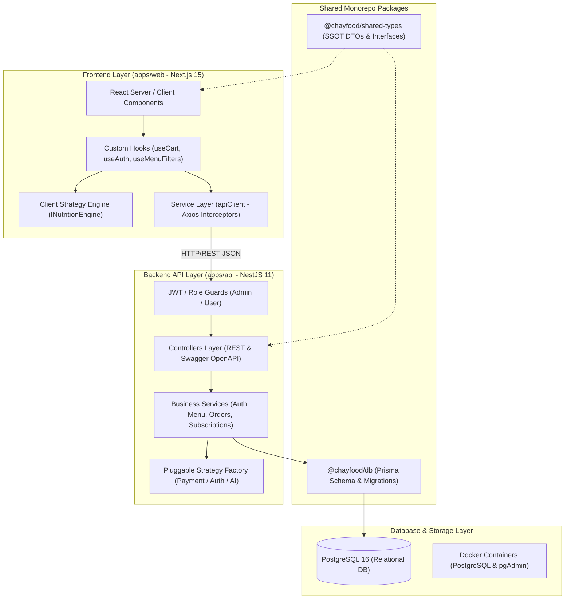

<div align="center">
  

  # 🌱 ChayFood Nutri-Tech 2.0
  ### Nền Tảng Ẩm Thực Thực Vật & Dinh Dưỡng Khoa Học (Precision Plant-Based Nutrition Platform)

  [](https://www.typescriptlang.org/)
  [](.github/workflows/ci.yml)
  [](.)
  [-black?logo=next.js)](https://nextjs.org/)
  [-E0234E?logo=nestjs)](https://nestjs.com/)
  [](https://www.postgresql.org/)
  [](https://www.prisma.io/)
  [](https://turbo.build/)

  <p align="center">
    <strong>Giải pháp công nghệ dinh dưỡng thực vật giải quyết bài toán thiếu hụt vi chất, cá nhân hóa thực đơn theo bệnh lý lâm sàng và tự động hóa gói ăn định kỳ.</strong>
  </p>
</div>

---

## 🎯 1. Tư Duy Sản Phẩm & Bài Toán Cần Giải Quyết (Product Thinking & Pain Points)

Ẩm thực chay đang chuyển dịch mạnh mẽ từ xu hướng tôn giáo truyền thống sang lối sống **Dinh Dưỡng Thực Vật Chủ Động (Holistic Plant-based Wellness)**. Tuy nhiên, người tiêu dùng hiện đại đang đối mặt với 3 rào cản lớn:

### 🚩 3 Pain Points Trọng Yếu Của Người Dùng:
1. **Nỗi Sợ Thiếu Hụt Đạm & Vi Chất (The Protein & Micronutrient Deficit Paradox)**:
   - *Vấn đề*: Người ăn chay (đặc biệt là người tập gym, thể thao hoặc người mới bắt đầu) thường lo sợ thiếu Protein sinh học, thiếu Sắt, Vitamin B12, hoặc vô tình nạp quá nhiều tinh bột tinh chế (Simple Carbs).
   - *Giải pháp của ChayFood*: **Minh bạch Macro**: Định lượng chính xác từng gram Đạm, Tinh bột chậm, Chất béo tốt và Calo trên từng món ăn và gói khẩu phần.
2. **Bệnh Lý Nền & Ràng Buộc Ăn Kiêng Phức Tạp (Complex Clinical Dietary Constraints)**:
   - *Vấn đề*: Người mắc bệnh mãn tính (Đái tháo đường, Huyết áp tim mạch, Gout/Axit uric cao, Dạ dày trào ngược GERD) hoặc dị ứng thực phẩm (Gluten, Đậu phộng, Đậu nành, Ngũ vị tân) rất khó tìm được thực đơn chuẩn y khoa bên ngoài.
   - *Giải pháp của ChayFood*: **Phòng Khám Dinh Dưỡng Thực Vật Cá Nhân Hóa (Nutri-Planner 2.0)** — Thuật toán tính chỉ số thể trạng (BMI, BMR, TDEE) và tự động hiệu chỉnh khẩu phần theo phác đồ bệnh lý lâm sàng.
3. **Mất Thời Gian Lên Thực Đơn & Chuẩn Bị (Meal Prep Fatigue)**:
   - *Vấn đề*: Mất từ 1-2 tiếng mỗi ngày để cân đo đong đếm calo và chế biến món chay dinh dưỡng.
   - *Giải pháp của ChayFood*: **Gói Ăn Định Kỳ Cá Nhân Hóa (Smart Subscription Engine)** — Tự động sinh thực đơn 4 bữa/ngày, giao nóng đúng khung giờ, hỗ trợ đổi món và tạm dừng linh hoạt.
4. **Nghịch Lý Bữa Cơm Gia Đình Đa Thế Hệ (Multi-Generation Family Dining Dilemma)**:
   - *Vấn đề*: Trong một gia đình sống chung nhiều thế hệ, ông bà cần ăn kiêng ít muối & giảm đường (huyết áp, tiểu đường), trẻ nhỏ cần năng lượng & canxi phát triển, người trẻ tập gym cần nhiều đạm, và có người bị dị ứng đậu phộng/gluten. Rất khó để chuẩn bị một bữa ăn chung mà vẫn đáp ứng trọn vẹn thể trạng riêng của từng thành viên.
   - *Giải pháp của ChayFood*: **Hồ Sơ Hộ Gia Đình & Mâm Cơm Hài Hòa (Harmonized Family Meal Planner & Subscriptions)** — Tích hợp quản lý hồ sơ đa thành viên (Managed Profiles cho người già/trẻ nhỏ và Invite Code cho người thân), thuật toán tự động loại bỏ dị ứng giao thoa, tối ưu hóa thực đơn mâm cơm 4-6 món hài hòa và đưa ra bảng hướng dẫn phân chia khẩu phần riêng biệt cho từng người trên cùng một bàn ăn.

---

## 🏗️ 2. Thiết Kế Hệ Thống & Kiến Trúc Kỹ Thuật (System Design & Architecture)

Hệ thống được thiết kế theo mô hình **Domain-Driven Design (DDD)** và kiến trúc Monorepo phân lớp tách biệt, đảm bảo khả năng mở rộng (Scalability), tính tái sử dụng cao (Reusability) và tính toàn vẹn dữ liệu (Data Integrity).



---

## 🔌 3. Áp Dụng Design Patterns & Generic Pluggable Providers

Dự án áp dụng chặt chẽ các mẫu thiết kế hướng đối tượng (OOP Design Patterns) nhằm loại bỏ sự phụ thuộc cứng vào các nhà cung cấp bên thứ ba (Third-party Vendor Lock-in):

### 1. Strategy Pattern & Factory Pattern Cho Tích Hợp Đa Dịch Vụ
- **Cổng Thanh Toán (`IPaymentProvider`)**:
  - Hỗ trợ chuyển đổi linh hoạt giữa `StripePaymentProvider`, `VietQRPaymentProvider`, `VnPayPaymentProvider` và `MockPaymentProvider` thông qua cấu hình môi trường hoặc Factory runtime.
- **Xác Thực & Định Danh (`IAuthProvider`)**:
  - Hỗ trợ hoán đổi giữa `JwtAuthProvider`, `OAuthGoogleProvider`, `OAuthFacebookProvider` và `MockAuthProvider`.
- **Thuật Toán Dinh Dưỡng (`INutritionEngine`)**:
  - Tách biệt `ClinicalPlantNutritionEngine` (tính toán BMR Mifflin-St Jeor, TDEE và phân bổ Macro bệnh lý) sẵn sàng mở rộng sang `OpenAINutritionEngine` hoặc AI Microservices.

### 2. Single Source of Truth (SSOT) & Strict TypeScript
- **Tuyệt đối cấm `any` và `unknown`**: 100% mã nguồn TypeScript được định kiểu nghiêm ngặt (Strict Type Safety).
- Mọi Interface, Enum, DTO dùng chung được tập trung duy nhất tại `packages/shared-types` và `packages/db`.

---

## 💻 4. Trải Nghiệm Người Dùng & Quy Chuẩn Thiết Kế (Editorial Food Tech 3.1)

Giao diện người dùng được định hình theo phong cách **Tạp chí Ẩm thực Đương đại (Editorial Culinary & Human-Crafted Minimalist)**, loại bỏ cảm giác đại trà của template AI:

1. **Content-First Hierarchy & Header Nhỏ Gọn**:
   - Header các trang con (`/menu`, `/nutrition-planner`, `/subscriptions`) được tối ưu nhỏ gọn (`py-6`, ~85px), không chiếm diện tích màn hình, giúp đưa danh sách món ăn và bộ lọc lên ngay trong tầm mắt (Above-the-Fold Priority).
2. **Dual View Mode (Trực Quan vs. Bảng Chỉ Số Macro)**:
   - Cho phép người dùng chuyển đổi tức thì giữa chế độ xem hình ảnh ẩm thực kích thích vị giác và chế độ xem phân tích vi chất chuyên sâu (Calo, Protein, Carbs, Fat).
3. **Tiết Chế Biểu Tượng (Icon Minimalism)**:
   - Loại bỏ icon/emoji trang trí rườm rà; chỉ sử dụng icon cho mục đích công năng điều hướng (`Search`, `Cart`, `Close`, `SlidersHorizontal`).
4. **Văn Phong Tiếng Việt Bản Địa Hóa & Trung Tính (Natural & Neutral Copywriting)**:
   - Tuyệt đối cấm dịch máy thô ráp (No word-by-word translation).
   - **Zero "mọi" & Zero "100%" Mandate**: Loại bỏ các từ ngữ tâng bốc tuyệt đối hóa sáo rỗng (*"100% Thuần chay"*, *"mọi lúc mọi nơi"*) ➔ Thay bằng từ ngữ trung tính, chuẩn mực y khoa & ẩm thực (*"Thuần thực vật"*, *"Minh bạch chỉ số"*, *"từng khẩu phần"*).
   - **No Trailing Dots**: Không để dấu chấm cuối tiêu đề, slogan, nút bấm và badge.

---

## 📂 5. Cấu Trúc Dự Án (Repository Structure)

```text
chayfood/
├── apps/
│   ├── web/                     # Frontend Next.js 15 (App Router, Tailwind CSS, Framer Motion)
│   │   ├── app/
│   │   │   ├── nutrition-planner/ # [NEW] Phòng khám dinh dưỡng cá nhân hóa & Tầm soát bệnh lý 2.0
│   │   │   ├── menu/            # Thực đơn đa chế độ xem (Dual View Mode) & Bộ lọc Macro
│   │   │   ├── subscriptions/   # Đăng ký gói ăn định kỳ theo mục tiêu sức khỏe
│   │   │   ├── cart & checkout/ # Giỏ hàng & luồng thanh toán đa phương thức
│   │   │   ├── admin/           # Dashboard quản trị danh mục, đơn hàng và khách hàng
│   │   │   └── components/      # UI components tái sử dụng (Atomic / Molecular Design)
│   │   └── package.json         # (@chayfood/web)
│   │
│   └── api/                     # Backend NestJS 11 Server (Enterprise Modular Architecture)
│       ├── src/
│       │   ├── auth/            # JWT Guard, RBAC Roles, Password Hashing (Bcrypt)
│       │   ├── menu/            # Quản lý thực đơn, tìm kiếm toàn văn & lọc vi chất
│       │   ├── orders/          # Quản lý đơn hàng, Webhook thanh toán
│       │   ├── subscriptions/   # Quản lý gói ăn & chu kỳ giao nhận
│       │   ├── recommendations/ # API lưu hồ sơ sở thích sức khỏe người dùng
│       │   └── prisma/          # Prisma Global Service
│       └── package.json         # (@chayfood/api)
│
├── packages/                    # Packages dùng chung toàn Monorepo
│   ├── db/                      # Prisma Client, PostgreSQL Schema, Migrations & Seed scripts
│   ├── shared-types/            # SSOT TypeScript DTOs, Interfaces, Enums
│   └── tsconfig/                # Cấu hình TypeScript chuẩn kế thừa
│
├── .system-design/rules/        # Quy tắc thiết kế hệ thống, Design Tokens & UI Guidelines (ui-and-design.md)
├── AGENTS.md / GEMINI.md        # Architectural Mandates & Guidelines
├── docker-compose.yml           # PostgreSQL 16 + pgAdmin local infrastructure
├── pnpm-workspace.yaml          # Quản lý monorepo workspaces
└── turbo.json                   # Cấu hình pipeline build & cache của Turborepo
```

---

## ⚡ 6. Hướng Dẫn Cài Đặt & Chạy Cục Bộ (Local Setup)

### Yêu Cầu Môi Trường
- **Node.js**: `>= 18.0.0`
- **pnpm**: `>= 9.0.0`
- **Docker & Docker Desktop**: Chạy PostgreSQL container

### Các Bước Thực Hiện:

```bash
# 1. Cài đặt toàn bộ dependencies
pnpm install

# 2. Khởi chạy cơ sở dữ liệu PostgreSQL trong Docker
pnpm db:up

# 3. Đẩy schema Prisma vào PostgreSQL & Nạp dữ liệu mẫu ban đầu
pnpm db:push
pnpm db:seed

# 4. Chạy đồng thời cả Frontend và Backend API
pnpm dev
```

### 🌐 Các Cổng Dịch Vụ:
- 🌐 **Frontend Web App**: [http://localhost:3000](http://localhost:3000)
- 🧮 **Phòng Khám Dinh Dưỡng Cá Nhân**: [http://localhost:3000/nutrition-planner](http://localhost:3000/nutrition-planner)
- 🚀 **Backend NestJS REST API**: [http://localhost:5000/api](http://localhost:5000/api)
- 📖 **Swagger API Documentation**: [http://localhost:5000/api/docs](http://localhost:5000/api/docs)
- 📊 **Prisma Studio (Xem CSDL trực quan)**: `pnpm db:studio` ➔ [http://localhost:5555](http://localhost:5555)

---

## 🧪 7. Kiểm Thử Tự Động & Đường Ống CI/CD (Quality Engineering & CI/CD Pipeline)

Hệ thống thiết lập tiêu chuẩn kiểm thử tự động nghiêm ngặt và quy trình CI/CD 4 Chặng bảo vệ chất lượng mã nguồn trước khi merge:

```text
  [ Push / Pull Request ]
             │
             ▼
  ┌─────────────────────────────────────────────────────────────┐
  │  Stage 1: Strict Type Integrity & Linting                  │
  │  • pnpm type-check (100% 0 error trên 5 packages)           │
  │  • pnpm lint (ESLint Rules Check)                          │
  └──────────────────────────────┬──────────────────────────────┘
                                 │ PASS
                                 ▼
  ┌─────────────────────────────────────────────────────────────┐
  │  Stage 2: Automated Unit & Spec Tests                      │
  │  • Jest (NestJS API): Dinh dưỡng, BOM, Kho bãi, Auth       │
  │  • Vitest (Next.js): Clinical Plant Nutrition Engine       │
  └──────────────────────────────┬──────────────────────────────┘
                                 │ PASS
                                 ▼
  ┌─────────────────────────────────────────────────────────────┐
  │  Stage 3: Postgres Container Migration & Seed Sanity       │
  │  • Spin-up Postgres 16 Alpine Service                      │
  │  • pnpm db:push & pnpm db:seed                             │
  └──────────────────────────────┬──────────────────────────────┘
                                 │ PASS
                                 ▼
  ┌─────────────────────────────────────────────────────────────┐
  │  Stage 4: Monorepo Production Build Validation             │
  │  • turbo run build (Next.js SSR/SSG & NestJS Dist Bundles) │
  └─────────────────────────────────────────────────────────────┘
```

### Lệnh Chạy Kiểm Thử:
```bash
# 1. Chạy toàn bộ test suites (Jest + Vitest)
pnpm test

# 2. Chạy type-check toàn bộ 5 packages với Turborepo
pnpm type-check

# 3. Chạy build production kiểm định
pnpm build
```

---

## 🏛️ 8. Hệ Thống Quy Chuẩn Thiết Kế & Quản Trị Dự Án (System Design & Governance)

Dự án tích hợp một **Khung Quy Chuẩn Thiết Kế Hệ Thống & Quản Trị Mã Nguồn Toàn Diện (System Design & Engineering Governance Framework)** giúp các kỹ sư và AI Coding Agent tự động phát hiện rủi ro, tuân thủ các điều kiện bất biến (Invariants) và bảo vệ chất lượng mã nguồn:

### 1. Thành Phần Cốt Lõi:
- **[SYSTEM_DESIGN.md](file:///c:/Users/MSI/Desktop/chayfood/SYSTEM_DESIGN.md)**: **Ma Trận Kích Hoạt Trung Tâm (Master Trigger Matrix)** hướng dẫn quy trình 8 bước trước khi viết code.
- **[`.system-design/rules/`](file:///c:/Users/MSI/Desktop/chayfood/.system-design/rules/)**: Kho 14 tệp quy tắc chuyên sâu về: *Xử lý đồng thời, Nhất quán giao dịch, An ninh BOLA/IDOR, Quản trị DB Indexing, Mẫu Strategy/Factory, Transactional Outbox, Cache-Aside, Testing Pyramid, Git Conventions*.
- **[`.github/`](file:///c:/Users/MSI/Desktop/chayfood/.github/)**: Mẫu PR Template chuẩn Enterprise ([pull_request_template.md](file:///c:/Users/MSI/Desktop/chayfood/.github/pull_request_template.md)), Giao thức phản hồi review ([review_response_template.md](file:///c:/Users/MSI/Desktop/chayfood/.github/review_response_template.md)) và Đường ống CI 4 chặng ([ci.yml](file:///c:/Users/MSI/Desktop/chayfood/.github/workflows/ci.yml)).

### 2. 🚀 Tái Sử Dụng & Cá Nhân Hóa Sang Dự Án Mới (Portability):
Toàn bộ bộ khung quy tắc này có thể sao chép và thích ứng với bất kỳ dự án phần mềm mới nào (TypeScript, Python, Go, C#, Java):
- Tham khảo hướng dẫn chi tiết tại **[.system-design/ADAPTATION_GUIDE.md](file:///c:/Users/MSI/Desktop/chayfood/.system-design/ADAPTATION_GUIDE.md)**
- Sử dụng **1-Click Master Meta-Prompt** để yêu cầu AI Agent tự động quét Stack, kiểm toán rủi ro, chuyển đổi mẫu code và hoàn thiện hệ thống quy tắc cho dự án mới trong 6 giai đoạn.

---

## 👨‍💻 Tác Giả & Liên Hệ
- **Dự Án**: ChayFood Monorepo (Plant-based Holistic Nutrition Platform)
- **Mục Đích**: Portfolio dự án kỹ thuật mẫu thể hiện tư duy System Design, Product Thinking, và Clean Code Architecture.
