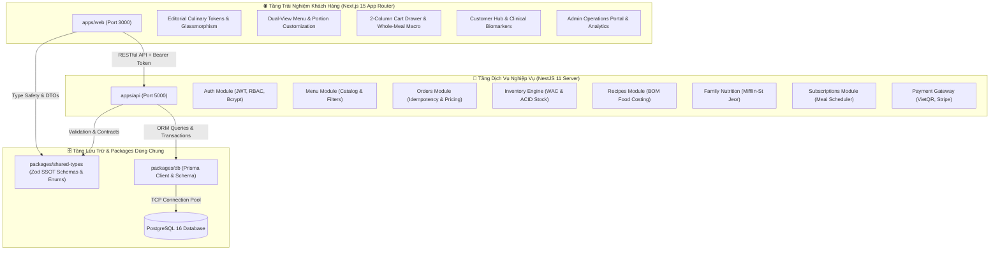

# 🌿 ChayFood Monorepo — Nền Tảng Ẩm Thực & Dinh Dưỡng Thực Vật Chuẩn Khoa Học

> **Enterprise Monorepo Architecture**: Hệ thống thương mại điện tử ẩm thực thuần thực vật, định lượng vi chất lâm sàng cá nhân hóa, định mức giá vốn nguyên liệu (BOM) và vận hành chuỗi cung ứng khép kín.  
> **Công nghệ cốt lõi**: Next.js 15 (App Router) • NestJS 11 (Modular REST API) • PostgreSQL 16 • Prisma ORM • Turborepo • TailwindCSS • Framer Motion

---

## 🌟 1. Tổng Quan Nền Tảng (Platform Overview)

**ChayFood** là nền tảng ẩm thực thuần thực vật thế hệ mới, tiên phong kết hợp giữa nghệ thuật ẩm thực truyền thống Việt Nam và khoa học dinh dưỡng lâm sàng. 

### Các Trụ Cột Năng Lực Trọng Tâm:
- 🍽️ **Thực Đơn Đa Chế Độ (Dual-View Menu)**: Chuyển đổi linh hoạt giữa giao diện nhiếp ảnh ẩm thực sang trọng và bảng ma trận mật độ vi chất dinh dưỡng.
- 🧮 **Động Cơ Dinh Dưỡng Lâm Sàng (Clinical Nutrition Engine)**: Tự động tính toán BMR, TDEE, phân bổ tỷ lệ Calo chuẩn $4\text{-}4\text{-}9$ (Đạm - Đường - Béo), và sàng lọc dị ứng chéo 2 chiều cho từng thành viên trong gia đình.
- 📦 **Quản Trị Kho & Định Mức Giá Vốn (BOM & WAC Inventory Engine)**: Tự động trừ kho nguyên liệu thô theo công thức món ăn (Bill of Materials), tính giá vốn bình quân gia quyền và kiểm soát biên lợi nhuận gộp theo thời gian thực.
- ⚡ **Pipeline Đặt Hàng & Thanh Toán Bất Biến (Idempotent Orders & VietQR)**: Khóa bi quan chống Over-selling, tự động sinh mã VietQR chuẩn NAPAS247 và cơ chế hoàn tiền tự động khi phát sinh chênh lệch.
- 📅 **Thuê Bao Gói Ăn Chay Định Kỳ (Smart Meal Subscriptions)**: Tự động lên lịch giao cơm theo chu kỳ tuần/tháng với thuật toán gợi ý món ăn thông minh chống trùng lặp.
- 👑 **Cổng Quản Trị Vận Hành Toàn Diện (Admin Operations Portal)**: Bảng điều khiển quản trị trực quan với biểu đồ Recharts, quản lý thực đơn, công thức BOM, kiểm soát kho bãi và khuyến mãi Flash Sale.

---

## 📐 2. Sơ Đồ Kiến Trúc Hệ Thống (System Architecture)

Hệ thống được tổ chức theo mô hình **Domain-Driven Modular Monorepo** với ranh giới phân tách rõ ràng giữa Frontend SSR/CSR, Backend API, tầng dữ liệu dùng chung và động cơ kiểm soát kho:



---

## 📦 3. Cấu Trúc Monorepo (Workspace Directory Structure)

```text
chayfood/
├── apps/
│   ├── web/                     # Frontend Next.js 15 App Router (@chayfood/web)
│   │   ├── app/
│   │   │   ├── account/         # Hồ sơ cá nhân, lịch sử đơn hàng & gói ăn định kỳ
│   │   │   ├── admin/           # Cổng quản trị thực đơn, kho bãi, BOM & doanh thu
│   │   │   ├── cart/            # Giỏ hàng thông minh & tổng hợp macro toàn bữa
│   │   │   ├── checkout/        # Quy trình thanh toán an toàn & địa chỉ giao hàng
│   │   │   ├── menu/            # Khám phá thực đơn 2 chế độ & chi tiết món ăn
│   │   │   ├── nutrition-planner/ # Phòng khám dinh dưỡng & hồ sơ sức khỏe
│   │   │   ├── order/           # Theo dõi trạng thái đơn hàng & mã VietQR
│   │   │   ├── globals.css      # Design Tokens & CSS Variables
│   │   │   └── layout.tsx       # RootLayout với Server Component SSR
│   │   └── package.json
│   │
│   └── api/                     # Backend NestJS 11 Enterprise Server (@chayfood/api)
│       ├── src/
│       │   ├── auth/            # JWT Strategy, RolesGuard, NIST 800-63B Auth
│       │   ├── menu/            # Quản lý món ăn, phân trang, lọc calo & protein
│       │   ├── inventory/       # Động cơ kho ACID, giá vốn WAC, khóa chống âm kho
│       │   ├── recipes/         # Định mức nguyên liệu BOM, tính food cost
│       │   ├── family/          # Dinh dưỡng gia đình lâm sàng & lọc dị ứng
│       │   ├── orders/          # Pipeline đặt hàng, khóa bi quan, VietQR
│       │   ├── subscriptions/   # Gói ăn định kỳ & gợi ý thực đơn thông minh
│       │   ├── payment/         # Xử lý cổng thanh toán (Strategy / Factory Pattern)
│       │   └── prisma/          # Prisma Global Module & Lifecycle Hooks
│       └── package.json
│
├── packages/
│   ├── db/                      # Prisma Schema, PostgreSQL Migrations & Seed Data
│   ├── shared-types/            # Nguồn chân lý duy nhất (SSOT Zod Schemas & Types)
│   └── tsconfig/                # Cấu hình TypeScript chuẩn toàn hệ thống
│
├── .system-design/rules/        # 14 bộ quy tắc thiết kế hệ thống & kiểm toán an ninh
├── SYSTEM_DESIGN.md             # Ma trận kích hoạt quy chuẩn thiết kế hệ thống
├── docker-compose.yml           # Hạ tầng PostgreSQL 16 + pgAdmin Docker
├── pnpm-workspace.yaml          # Cấu hình Turborepo Workspaces
└── turbo.json                   # Pipeline biên dịch và Remote Caching
```

---

## 🧮 4. Các Động Cơ Kỹ Thuật Trọng Điểm (Core Engineering Engines)

### 1. Động Cơ Dinh Dưỡng Lâm Sàng (Clinical Nutrition Engine)
- **Công thức Mifflin-St Jeor**: Tính toán BMR và TDEE chuẩn xác theo tuổi, giới tính sinh học, chiều cao, cân nặng và hệ số vận động.
- **Phân bổ tỷ lệ Calo chuẩn $4\text{-}4\text{-}9$**:
  $$\text{Tổng Năng Lượng (kcal)} = (\text{Protein} \times 4) + (\text{Carbs} \times 4) + (\text{Fat} \times 9)$$
- **Sàng lọc dị ứng 2 chiều**: Tự động loại trừ các món ăn chứa thành phần kiêng kị hoặc dị ứng của từng thành viên trong gia đình.

### 2. Động Cơ Định Mức BOM & Giá Vốn WAC (BOM & Inventory Engine)
- **Bill of Materials (BOM)**: Mỗi món ăn được cấu thành từ danh mục nguyên liệu thô với hệ số quy đổi đơn vị chuẩn hóa ($g \to kg$, $ml \to l$).
- **Giá vốn bình quân gia quyền (Weighted Average Cost - WAC)**:
  $$\text{WAC Mới} = \frac{(\text{Tồn Cũ} \times \text{Giá Vốn Cũ}) + (\text{Nhập Mới} \times \text{Giá Nhập Mới})}{\text{Tổng Tồn Mới}}$$
- **Tự động trừ kho nguyên tử (ACID Stock Deduction)**: Trừ kho trực tiếp trong Database Transaction ngay khi đơn hàng được tạo, chặn triệt để tình trạng âm kho hoặc Over-selling.

### 3. Pipeline Đặt Hàng & Thanh Toán Bất Biến (Idempotent Orders)
- **Server-Authoritative Pricing**: Giá món ăn, phí giao hàng và khuyến mãi voucher được tính toán độc lập tại server, miễn nhiễm với tấn công can thiệp dữ liệu từ client.
- **Khóa bi quan (Pessimistic Locking)**: Chống Race Condition khi nhiều khách hàng cùng đặt món ăn có số lượng giới hạn tại cùng một thời điểm.
- **VietQR Động**: Tự động sinh mã QR ngân hàng kèm mã đơn hàng định danh, kích hoạt webhook xác nhận thanh toán tức thì.

---

## ⚡ 5. Hướng Dẫn Cài Đặt & Chạy Cục Bộ (Local Setup)

### Yêu Cầu Môi Trường
- **Node.js**: `>= 18.0.0`
- **pnpm**: `>= 9.0.0`
- **Docker & Docker Desktop**: Chạy cơ sở dữ liệu PostgreSQL

### Các Bước Khởi Chạy:

```bash
# 1. Cài đặt toàn bộ dependencies trong monorepo
pnpm install

# 2. Khởi chạy PostgreSQL trong Docker
pnpm db:up

# 3. Đồng bộ schema Prisma vào database và nạp dữ liệu mẫu
pnpm db:push
pnpm db:seed

# 4. Khởi chạy toàn bộ hệ thống (Frontend + Backend)
pnpm dev
```

### 🌐 Các Cổng Dịch Vụ:
- 🌐 **Frontend Web Client**: [http://localhost:3000](http://localhost:3000)
- 🧮 **Phòng Khám Dinh Dưỡng Cá Nhân**: [http://localhost:3000/nutrition-planner](http://localhost:3000/nutrition-planner)
- 🚀 **Backend NestJS REST API**: [http://localhost:5000/api](http://localhost:5000/api)
- 📖 **Swagger API Interactive Documentation**: [http://localhost:5000/api/docs](http://localhost:5000/api/docs)
- 📊 **Prisma Studio (Giao diện xem CSDL)**: `pnpm db:studio` ➔ [http://localhost:5555](http://localhost:5555)

---

## 🧪 6. Quy Trình Kiểm Thử Tự Động & CI/CD Pipeline

Dự án áp dụng tiêu chuẩn kiểm thử tự động nghiêm ngặt bảo vệ 100% chất lượng mã nguồn:

```text
  [ Push / Pull Request ]
             │
             ▼
  ┌─────────────────────────────────────────────────────────────┐
  │  Stage 1: Strict Type-Check (Turborepo)                    │
  │  • 100% PASS trên toàn bộ 5 packages (0 Type Error)        │
  │  • Tuân thủ nghiêm ngặt RULE-CODE-001 (Zero any / unknown) │
  └──────────────────────────────┬──────────────────────────────┘
                                 │ PASS
                                 ▼
  ┌─────────────────────────────────────────────────────────────┐
  │  Stage 2: Automated Unit & Integration Tests               │
  │  • 12/12 Test Suites PASS, 79/79 Unit Tests PASS           │
  │  • Kiểm thử toàn diện Auth, WAC, BOM, Orders, Subs, Family │
  └──────────────────────────────┬──────────────────────────────┘
                                 │ PASS
                                 ▼
  ┌─────────────────────────────────────────────────────────────┐
  │  Stage 3: Database Migration & Seeding Validation          │
  │  • PostgreSQL 16 Container Sanity Verification             │
  │  • Schema Invariants & Relationship Integrity              │
  └──────────────────────────────┬──────────────────────────────┘
                                 │ PASS
                                 ▼
  ┌─────────────────────────────────────────────────────────────┐
  │  Stage 4: Production Build Validation                      │
  │  • Next.js App Router SSR/SSG Bundle Compilation           │
  │  • NestJS Server Production Dist Compilation               │
  └─────────────────────────────────────────────────────────────┘
```

### Lệnh Chạy Kiểm Thử:
```bash
# 1. Chạy toàn bộ 79 unit tests backend
pnpm test

# 2. Chạy type-check toàn bộ 5 packages trong monorepo
pnpm type-check

# 3. Chạy kiểm tra build production
pnpm build
```

---

## 🏛️ 7. Hệ Thống Quy Chuẩn Quản Trị Dự Án (System Design Governance)

Dự án tích hợp bộ khung quản trị mã nguồn chuẩn Enterprise:
- **[SYSTEM_DESIGN.md](file:///c:/Users/MSI/Desktop/chayfood/SYSTEM_DESIGN.md)**: **Ma Trận Kích Hoạt Trung Tâm (Master Trigger Matrix)** hướng dẫn quy trình kiểm toán rủi ro trước khi triển khai tính năng.
- **[`.system-design/rules/`](file:///c:/Users/MSI/Desktop/chayfood/.system-design/rules/)**: 14 tài liệu quy chuẩn chuyên sâu về an ninh (IDOR/BOLA), xử lý đồng thời (Pessimistic/Optimistic Locking), nhất quán giao dịch ACID, và tiêu chuẩn giao diện Editorial UX ([`ui-and-design.md`](file:///c:/Users/MSI/Desktop/chayfood/.system-design/rules/ui-and-design.md)).
- **[`.agents/skills/review-learning/`](file:///c:/Users/MSI/Desktop/chayfood/.agents/skills/review-learning/)**: Kỹ năng huấn luyện và review code có hệ thống theo phương pháp Socratic.

---

## 👨‍💻 Tác Giả & Tuyên Bố Bản Quyền
- **Dự Án**: ChayFood Monorepo (Precision Plant-Based Nutrition & Holistic Culinary Platform)
- **Mục Đích**: Dự án kỹ thuật tiêu chuẩn thể hiện tư duy System Design, Product Thinking và Clean Code Architecture
